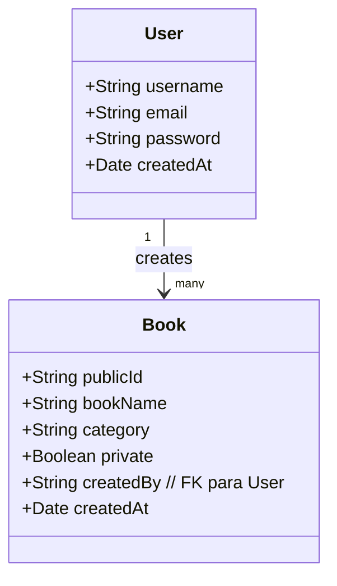

```mermaid
classDiagram
    class User {
        +String username
        +String email
        +String password
        +Date createdAt
    }

    class Book {
        +String publicId
        +String bookName
        +String category
        +Boolean private
        +String createdBy // FK para User
        +Date createdAt
    }

    User "1" --> "many" Book : creates

```
